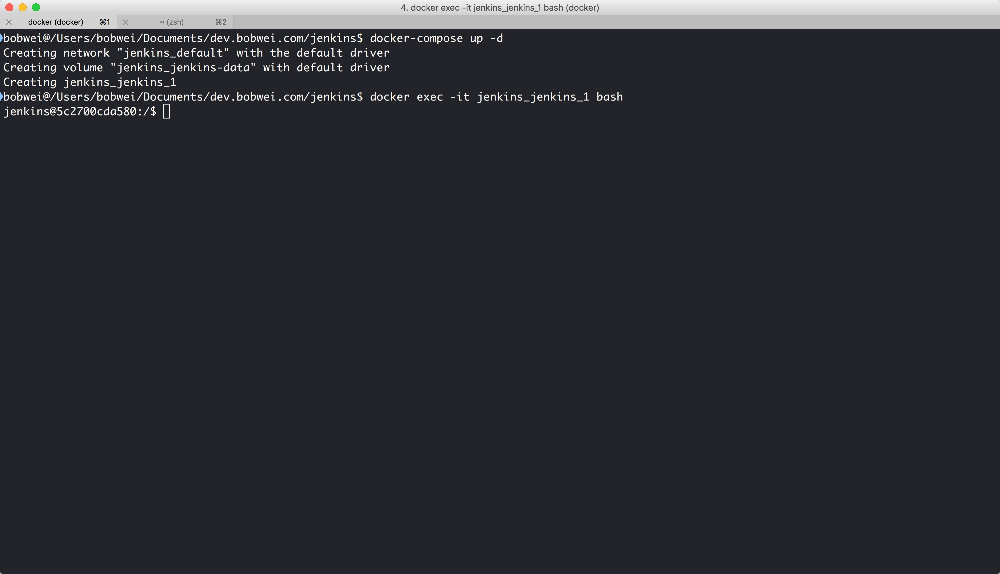
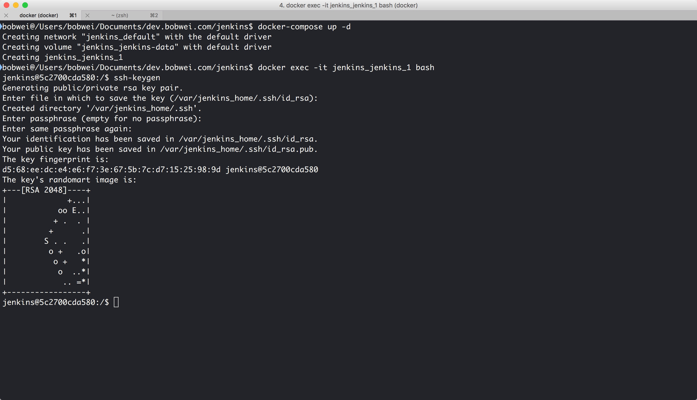

Todo :
* 建立 deploy key for git repositories

References :
* [Authenticate Jenkins CI for Github private repository](http://stackoverflow.com/questions/5212304/authenticate-jenkins-ci-for-github-private-repository)
* [伺服器上的 Git - 生成 SSH 公開金鑰](https://git-scm.com/book/zh-tw/v1/%E4%BC%BA%E6%9C%8D%E5%99%A8%E4%B8%8A%E7%9A%84-Git-%E7%94%9F%E6%88%90-SSH-%E5%85%AC%E9%96%8B%E9%87%91%E9%91%B0)

### 建立 Deploy Key for Git Repositories

首先進入到 Jenkins container

```
$ docker exec -it $JENKINS_CONTAINER_NAME bash
```



在 container 裡執行

```
$ ssh-keygen
```

此步驟會建立一組 private key 與 public key 到 ~/.ssh 資料夾



將產生出來的 public key 貼到 github repo 設定頁面裡的 deploy keys
